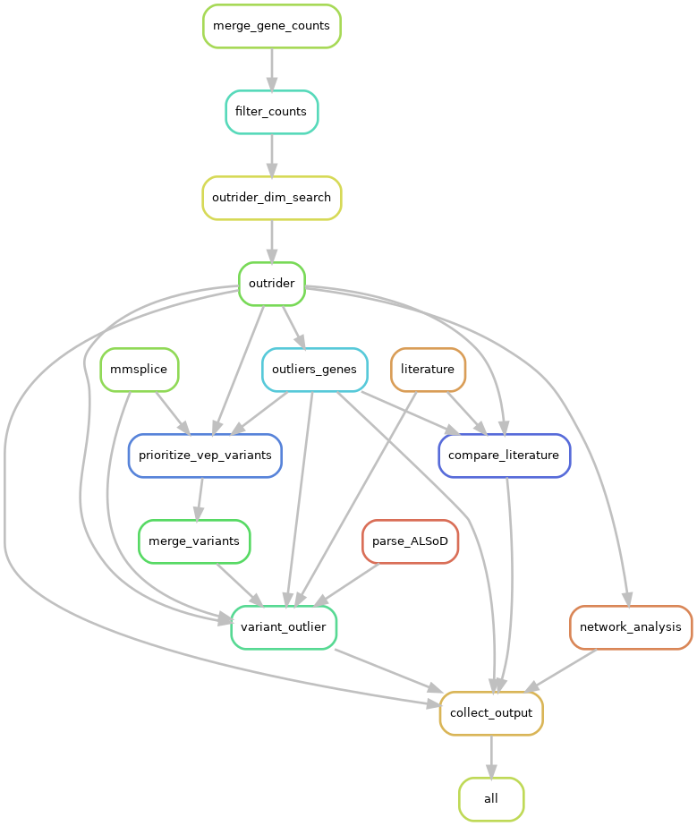

End ALS Kaggle Challenge
==============================

**When the outlier is the signal**

[TODO: introduction & motivation]

Installation
------------

Please install the following conda environment from the repository root.

```commandline
conda env create -f environment.yml
```

**Note:** You can alternatively use [mamba](https://mamba.readthedocs.io/en/latest/index.html) for faster install times, if you prefer.

Run the pipeline
----------------

The workflow is implemented as a [Snakemake](https://snakemake.github.io) pipeline.
Snakemake is installed from the conda command above.
Before running the pipeline, please adapt the `configs/config.yaml` file so that it links to the correct input.

After adjusting the paths according to your input locations, you can call the pipeline from the repository root via

```commandline
snakemake -n
```

This should give you an overview of the jobs that Snakemake would want to run.
This is a good point to check of the input and output paths are set correctly.
If this step completes without errors, you can continue to execute the steps shown.
We recommend you to start by visualizing the actual workflow as a directed acyclic graph first, for a better understanding of what is run.
The following command creates a dependency file of the rules (`reports/figures/dependency/rulegraph.png`) as well as all runs (`reports/figures/dependency/dag.png`):

```commandline
snakemake dependency -j 1
```

where `-j 1` allows the pipeline to use at most 1 core.




To run the complete pipeline with e.g. 10 cores, call

```commandline
snakemake -j 10
```

All independent steps will run in parallel if you specify more than 1 core.


Folder Structure
----------------

    ├── LICENSE
    |
    ├── README.md          <- The top-level README for developers using this project.
    |
    ├── configs            <- Config files for Snakemake pipeline
    |
    ├── data
    │   ├── external       <- Data from third party sources.
    │   ├── interim        <- Intermediate data that has been transformed.
    │   ├── processed      <- The final, canonical data sets for modeling.
    │   └── raw            <- The original, immutable data dump.
    │
    ├── docs               <- A default Sphinx project; see sphinx-doc.org for details
    │
    ├── notebooks          <- Jupyter notebooks. Naming convention is a number (for ordering),
    │                         the creator's initials, and a short `-` delimited description, e.g.
    │                         `1.0-jqp-initial-data-exploration`.
    │
    ├── references         <- Data dictionaries, manuals, and all other explanatory materials.
    │
    ├── reports            <- Generated analysis as HTML, PDF, LaTeX, etc.
    │   └── figures        <- Generated graphics and figures to be used in reporting
    │
    ├── workflow           <- Snakemake workflow
    |   ├── notebooks      <- Notebooks to be rendered during pipeline execution
    |   ├── scripts        <- Scripts to be run during pipeline execution
    |   └── Snakefile      <- Snakefile with all the Snakemake rules
    |
    ├── environment.yml   <- Conda environment for reproducing the pipeline
    |
    ├── requirements.txt   <- The requirements file for reproducing the analysis environment, e.g.
    │                         generated with `pip freeze > requirements.txt`
    │
    └── tox.ini            <- tox file with settings for running tox; see tox.readthedocs.io
